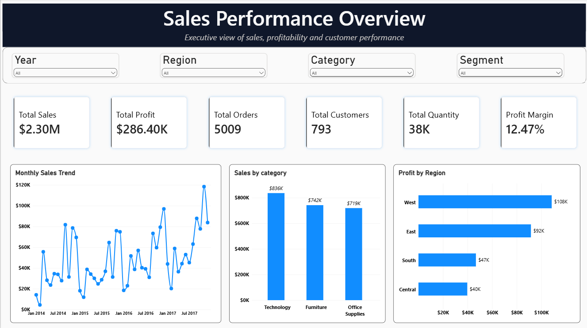
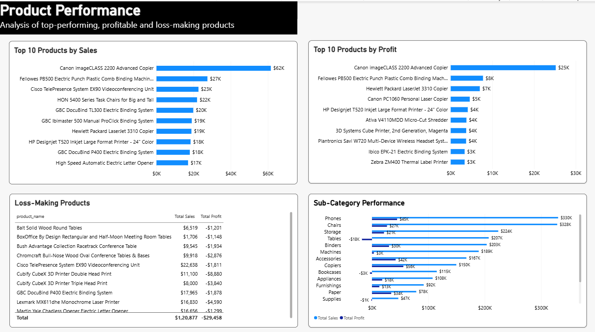
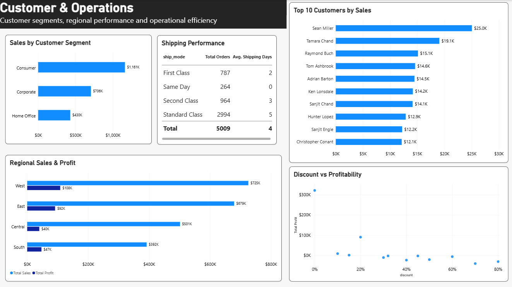

# Sales Performance Dashboard

An end-to-end sales data analysis project using Python, Pandas, SQL, and Power BI to analyze sales performance, profitability, products, customers, regions, discounts, and shipping operations.

## Project Overview

This project analyzes the Superstore sales dataset to identify business trends and provide actionable insights through data cleaning, exploratory analysis, SQL analysis, and an interactive Power BI dashboard.

## Tools & Technologies

- Python
- Pandas
- NumPy
- Jupyter Notebook
- MySQL
- SQL
- Power BI
- DAX
- GitHub

## Project Workflow

Raw Dataset  
↓  
Data Cleaning using Python & Pandas  
↓  
Feature Engineering  
↓  
Exploratory Data Analysis  
↓  
SQL Analysis using MySQL  
↓  
Power BI Dashboard  
↓  
Business Insights & Recommendations

## Dataset

The project uses the Superstore dataset downloaded from Kaggle.

The raw dataset is stored in:

`data/raw/Superstore.csv`

## Data Cleaning

The dataset was cleaned using Python and Pandas.

Key cleaning steps included:

- Standardizing column names
- Removing leading and trailing spaces
- Converting date columns into datetime format
- Handling invalid date values
- Checking missing values
- Checking duplicate records
- Converting columns to appropriate data types
- Creating derived analytical columns

## Feature Engineering

The following features were created:

- Shipping Days
- Year
- Month
- Year-Month
- Profit Margin

## Python Analysis

The Jupyter Notebook contains:

- Data exploration
- Data quality checks
- KPI calculations
- Category analysis
- Regional analysis
- Subcategory analysis
- Product analysis
- Customer analysis
- Segment analysis
- Discount analysis
- Shipping analysis
- Business insights

Notebook:

`notebooks/Sales_Performance_Analysis.ipynb`

## SQL Analysis

MySQL was used to perform business-oriented SQL analysis.

The SQL analysis includes:

- Overall sales and profit
- Category performance
- Regional performance
- Subcategory performance
- Top products by sales
- Top products by profit
- Loss-making products
- Customer analysis
- Segment analysis
- Monthly sales trends
- Discount analysis
- Shipping analysis
- Negative-profit transactions
- Product and customer counts

SQL file:

`sql/sales_analysis.sql`

## Power BI Dashboard

The Power BI dashboard contains three pages.

### 1. Executive Overview

Includes:

- Total Sales
- Total Profit
- Total Orders
- Total Customers
- Profit Margin
- Monthly Sales Trend
- Sales by Category
- Profit by Region
- Year, Region, Category and Segment filters

### 2. Product Performance

Includes:

- Top 10 Products by Sales
- Top 10 Products by Profit
- Bottom 10 Loss-Making Products
- Subcategory Performance
- Product-level analysis

### 3. Customer & Operations

Includes:

- Top 10 Customers by Sales
- Sales by Customer Segment
- Regional Performance
- Discount vs Profitability
- Shipping Performance

Power BI file:

`powerbi/Sales_Performance_Dashboard.pbix`

## Dashboard Screenshots

### Executive Overview



### Product Performance



### Customer & Operations



## Key Business Insights

- Technology generated the highest sales and profit among the three product categories.
- Office Supplies recorded the highest quantity sold.
- Furniture generated relatively high sales but comparatively low profit.
- The West region generated the highest sales and profit.
- The South region had the lowest sales but generated higher profit than the Central region.
- Sales volume does not always directly translate into higher profitability.

## Recommendations

- Focus on high-performing Technology products and identify opportunities for further growth.
- Investigate the lower profitability of Furniture products.
- Analyze regional performance to identify opportunities for improving sales and margins.
- Monitor loss-making products and investigate the reasons behind negative profitability.
- Analyze the effect of discounts on profit margins.
- Monitor shipping performance to identify operational improvement opportunities.

## Project Structure

```text
Sales-Performance-Dashboard/
│
├── data/
│   ├── raw/
│   │   └── Superstore.csv
│   └── cleaned/
│       └── cleaned_superstore.csv
│
├── notebooks/
│   └── Sales_Performance_Analysis.ipynb
│
├── sql/
│   └── sales_analysis.sql
│
├── powerbi/
│   └── Sales_Performance_Dashboard.pbix
│
├── screenshots/
│   ├── executive_overview.png
│   ├── product_performance.png
│   └── customer_operations.png
│
├── .gitignore
└── README.md
